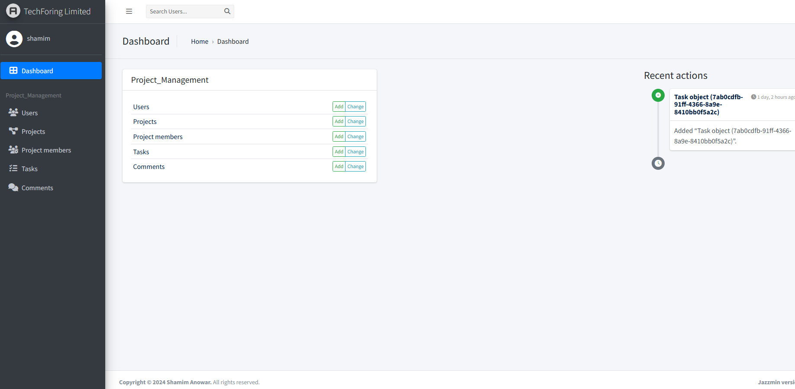
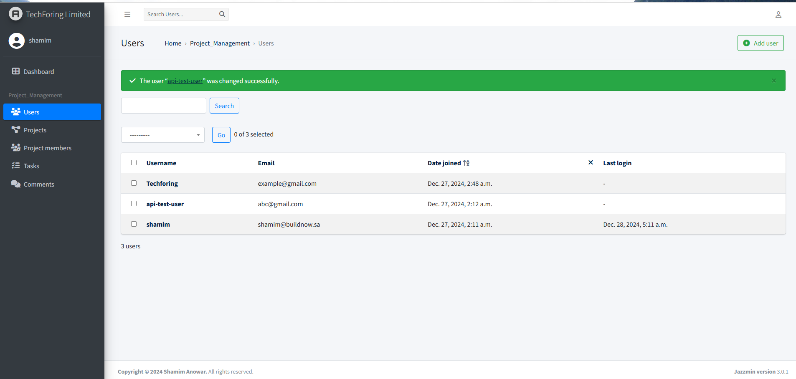
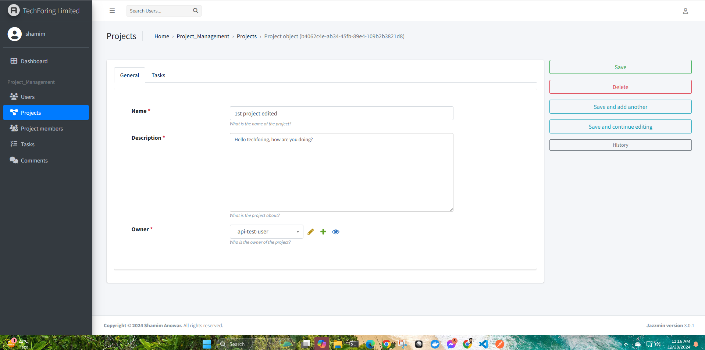
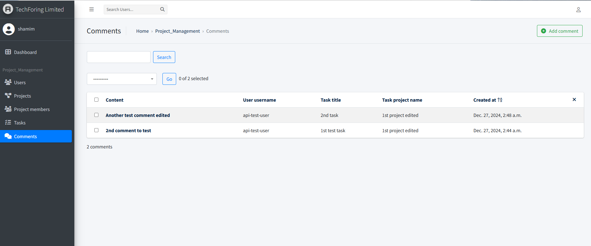
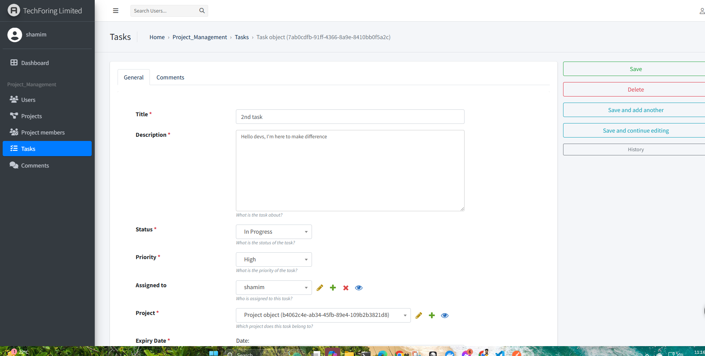

# TechForing Project Management Tool

TechForing Limited is building a project management tool that allows teams to collaborate on projects. The tool includes features for managing users, projects, tasks, and comments.

## Features

- User registration and authentication
- Project creation and management
- Task creation and management
- Commenting on tasks
- JWT-based authentication
- Swagger and Postman documentations for API endpoints

## Some Screenshots

### Dashboard


### User List Page


### Project Details Page


### Comment List Page


### Task Details Page



## Installation

1. Clone the repository:
    ```bash
    git clone https://github.com/Shamimanowar/techforing-project-management.git
    cd techforing
    ```

2. Create a virtual environment and activate it:
    ```bash
    python -m venv env
    source env/bin/activate  # On Windows, use `env\Scripts\activate`
    ```

3. Install the dependencies:
    ```bash
    pip install -r requirements.txt
    ```

4. Apply the migrations:
    ```bash
    python manage.py migrate
    ```

5. Create a superuser:
    ```bash
    python manage.py createsuperuser
    ```

6. Run the development server:
    ```bash
    python manage.py runserver
    ```

7. Access the admin panel at `http://127.0.0.1:8000/admin/` and the Swagger documentation at `http://127.0.0.1:8000/swagger/`. Markdown support is enabled here, you can brows the endpoints.

## Running Tests

To run the tests, use the following command:
```bash
python manage.py test
```
Postman collection is also added in the the docs folder, you can import and use this from postman desktop client.

## API Endpoints

The following API endpoints are available:

### Users
- Register User: `POST /app/users/`
- Login User: `POST /api/login/`
- Login List: `POST /app/users/`
- Get User Details: `GET /app/users/{id}/`
- Update User: `PUT/PATCH /app/users/{id}/`
- Delete User: `DELETE /app/users/{id}/`

### Projects
- List Projects: `GET /app/projects/`
- Create Project: `POST /app/projects/`
- Retrieve Project: `GET /app/projects/{id}/`
- Update Project: `PUT/PATCH /app/projects/{id}/`
- Delete Project: `DELETE /app/projects/{id}/`

### Tasks
- List Tasks: `GET /app/tasks/`
- Create Task: `POST /app/tasks/`
- Retrieve Task: `GET /app/tasks/{id}/`
- Update Task: `PUT/PATCH /app/tasks/{id}/`
- Delete Task: `DELETE /app/tasks/{id}/`

### Comments
- List Comments: `GET /app/comments/`
- Create Comment: `POST /app/comments/`
- Retrieve Comment: `GET /app/comments/{id}/`
- Update Comment: `PUT/PATCH /app/comments/{id}/`
- Delete Comment: `DELETE /app/comments/{id}/`

## License

None


## Help

If you need any help, feel free to reach out to me:

- Email: [shamim.hire@gmail.com](mailto:shamim.hire@gmail.com)
- Phone: +880 1612 879888